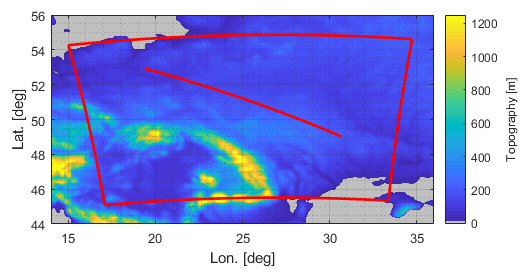
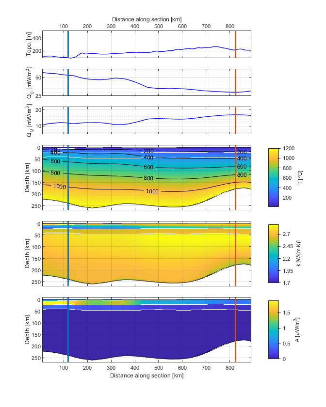
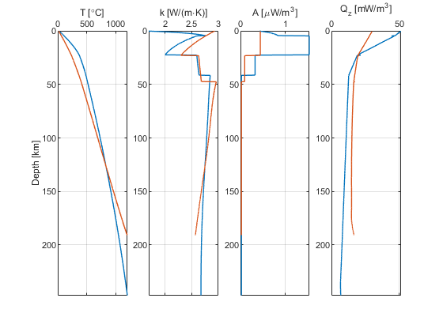

# PaBr19 Accompanying Data

Accompanying data to the submitted manuscript "A geothermal application for GOCE satellite gravity data: modelling the crustal heat production and lithospheric temperature field in Central Europe".

This data has been prepared as a git repository.

Alberto Pastorutti and Carla Braitenberg, 2019.

## `grav` directory

We provide the grids of gravity data and reductions as plain ASCII files, in (x, y, z) format, comma delimited. The grids cover the extents of area "B", Fig. 2.
All the data is provided in mGal (10-5 m s-2).

* `GGM.xyz` gravity disturbance from `GO_CONS_GCF_2_TIM_r5` GGM, up to d/o 280.
*-* `TOPO.xyz` topographic effect, as gravity disturbance from `RET2014`, up to d/o 280.
* `ISOS.xyz` far-field effect of crustal roots (global), radial component of _g_, synthesised up to d/o 280.
* `SEDS.xyz` sediment infill effect, contrast against 2670 kg/m³. Radial component of _g_, synthesised up to d/o 280.
* `GGMr.xyz` gravity disturbance from the GGM after applying the data reductions.

## `inv` directory

Inverted Moho depth and residuals, provided in the same format as gravity data. For plotting purposes, these grids were un-projected from a UTM35N, and a minimum rectangular bounding box was kept. Due to convergence of meridians, they are slighty smaller than area "B" and area "C".
The thermal model includes the full UTM35N extent of the inverted Moho depth (area "C").

* `MOHO.xyz` Moho depth, km.
* `MOHOres.xyz` Gravity residuals of inverted Moho, mGal.

## `thermal` directory

Input and output of the thermal solver and iterative RHP fitting procedure. Data is provided as .mat files. They can be accessed natively in Matlab or Octave, or in Python through [scipy.io.loadmat](https://docs.scipy.org/doc/scipy/reference/generated/scipy.io.loadmat.html). Default behaviour of loadmat will output Matlab structs as numpy record arrays.

* `Tgrid.mat`, grid coordinates for the thermal model. It contains a struct with the following fields:

  * `x` - vector of UTM35N easting of nodes, step is constant
  * `y` - vector of UTM35N northing of nodes, step is constant 
  * `z` - vector of z coordinates of nodes, positive downwards (this means that topography above msl is negative). Step is coarsening with depth.
  * `UTMstruct` - used map projection (UTM35N), in the form of a map projection structure (see Matlab `defaultm` [documentation](https://mathworks.com/help/map/ref/defaultm.html))
  * `Extents` - vertices of a (x, y) rectangle defining the thermal model area. Vertices are given starting from SW vertex, clockwise.

  The three (x, y, z) coordinate vectors define a rectangular 3D volume, with constant sampling along the horizontal direction and variable sampling along depth. When the volume is visualised this must be taken into account accordingly (by providing z coordinates or by resampling to a constant step).

* `TOUT_VOL.mat`, model volume at the last iteration. Nodes are arranged in a (z, x, y) order. It is a struct named `TOUT_VOL` containing the following 3D arrays, as fields:

  * `L` - layer ID (1 "air" above topography, 2 sediments, 3 upper crust, 4 lower crust, 5 SCLM, 6 "asthenosphere" below SCLM)
  * `A` - radioactive heat production, per unit of volume, in 10-6 W m-2. A is set to 99 under the LAB and 
  * `k` - thermal conductivity, in W m-1 K-1
  * `P` - lithostatic pressure, in Pa
  * `Rho` - density, in kg m-3

* `TOUT_iter.mat`, model derived quantities trough the RHP fitting iterations. It is a struct named `TOUT_iter` containing the following fields:

  * `Q0` - surface heat flow
  * `Qm` - basal heat flow (at Moho)
  * `Qs` - heat flow at the sediment to crystalline crust basement
  * `misfit` - surface heat flow difference between forward model (Q0) and measurements (where available, NaN everywhere else)
  * `UCA` - Upper Crust RHP used in this iteration
  * `LCA` - Lower Crust RHP used in this iteration
  * `kEQ` - Serie thermal conductivity along each LAB to surface column

  All the `TOUT_iter.mat` fields are 1-by-7 cell arrays. Each cell therein represents one RHP fitting iteration (including the starting conditions, in the first cell). Each cell is a (x, y) array.

* `ProcessedHF.mat`, 2D array (x, y) of filtered surface heat flow measurements on the model grid. NaN where no data is available.

## `src` directory

We provide two Matlab/Octave functions to ease the exploration of the thermal volume:

* `TOUT_section.m`
* `TOUT_sectionCall.m`

The `TOUT_sectionCall` function is a tool to interactively plot sections (vertical slices) of the volumes, and of two columns in each section (i.e. depth-wise plots of temperature, thermal conductivity, heat production, heat flow).
It acts as a wrapper for `TOUT_section`, which can be called directly.

`TOUT_sectionCall` must be called without arguments.

First figure: map view. The figure waits for two clicks, defining the section path.

Second figure: section. Same format as section provided in the manuscript. The figure waits for two clicks, defining the along-section position of columns.

Third figure: columns.

## `topo` directory

`ETOPO1_005d_crop.mat` is a crop of ETOPO1 ([doi:10.7289/V5C8276M](http://dx.doi.org/10.7289/V5C8276M)) in the study area. It is used in `TOUT_sectionCall` to provide a geographical background for the area map.
